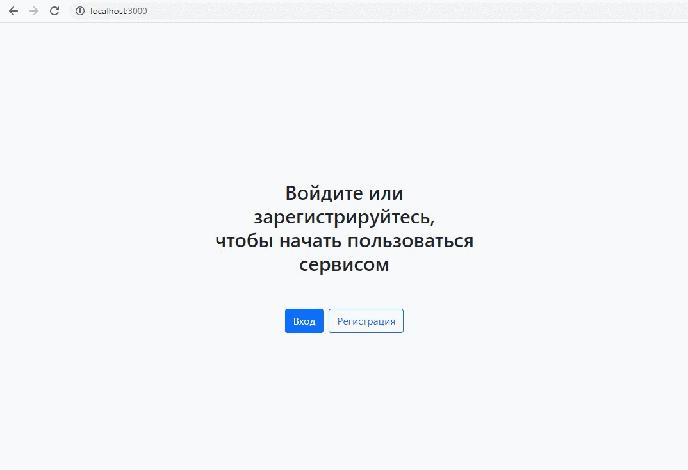

# iDatica

Фронтенд часть сервиса для отслеживания динамики изменения цен на товары.
В приложении реализованы следующие возможности:
* авторизация и регистрация пользователей;
* возможность изменить данные пользователя;
* создание, редактирование и удаление карточки продукта с его ценой, артикулом и прочими данными;
* добавление в карточку продукта ссылок на него с сайтов конкурентов для отслеживания цены, редактирование ссылок и их удаление;
* разделение продуктов на группы и категории для удобной сортировки;
* создание, редактирование и удаление расписаний отслеживания цены товаров из группы.




## Примененные навыки и технологии
* Вёрстка
  - вёрстка реализована с помощью CSS фреймворка Bootstrap
  - вёрстка и валидация всех форм

* React
  - использование Create React App
  - хуки `useState`, `useEffect`, `useRef`, кастомные хуки для сбора данных и валидации форм, для регистрации и аутентификации
  - поднятие стейта
  - глобальный стейт через React Context
  - управляемые компоненты в элементах форм
  - использование реф для прямого доступа к DOM-элементам

* React Router
  - реализован функционал  регистрации и авторизации
  - защищенные маршруты
  - авторизация через JWT
  - хранение токена в Local Starage

### Инструкция по развёртыванию проекта:
```bash
# клонирование репозитория
$ git clone https://github.com/yakravtsova/idatica-dev.git
# установка зависимостей
$ npm install
# запуск develop-сборки фронтенда
$ npm run start
```
